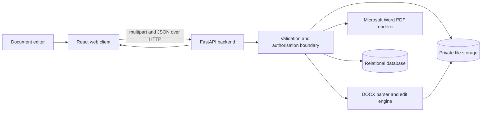
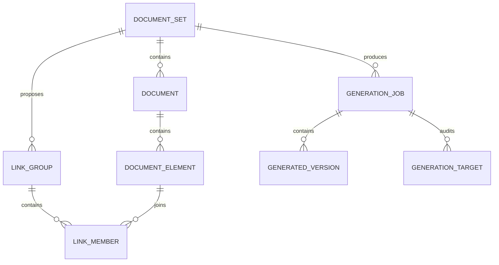
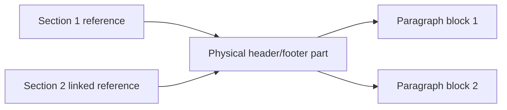
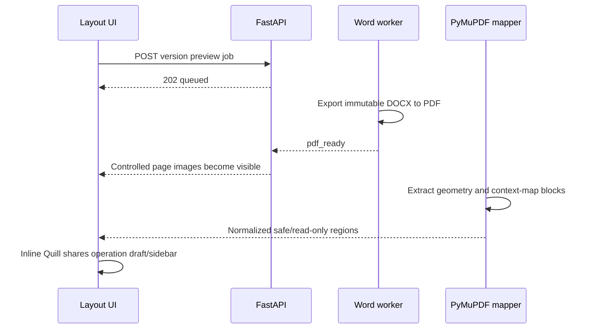

# Phase 2 architecture

## Trust boundary

The browser never receives database credentials or storage credentials. All document access, matching, preview, generation, and download decisions pass through the backend.

## Local-development storage

- Original files: `apps/api/data/originals/{document-set-id}/`
- Generated files: `apps/api/data/generated/{document-set-id}/{generation-id}/`
- Cached Word-layout PDFs: `apps/api/data/renders/{document-set-id}/`
- Local database: `apps/api/data/documentsync.db`

The paths are excluded from Git. Production deployment should replace local storage with private object storage and use short-lived or backend-mediated downloads.

## Relational model

## Controlled edit rule

A generated edit may only target `DocumentElement` rows that belong to the selected `LinkGroup`. The browser sends the explicitly included element IDs and the backend validates membership and requires the selected source element to remain included. Similarity or exact matching alone does not perform an edit; the user confirms the target list and reviews the impact before generation.

## Complete text inventory and batch boundary

Workspace Find & Replace does not equate editable `DocumentElement` rows with
all searchable Word text. The OOXML inventory builds logical paragraph/story
streams with character-to-node mappings for complex Word parts. Protected text
remains visible in results. Durable batch operations pin immutable base versions
and compile all rich-editor and substring targets into a conflict-free plan.
Generation groups that plan by document, stages each affected DOCX once, and
advances all heads in one completion transaction. See
[Batch editing and complete Word text inventory](batch-find-replace-text-inventory.md).

## Viewer and working-version boundary

The visual tab is a PDF exported by the installed Microsoft Word engine, so it uses Word's fonts, pagination, tables, images, headers, and footers. The separate Select text tab derives deterministic logical pages from extracted body elements and provides stable, keyboard-accessible element selection. Direct selection over the PDF awaits an element-to-render coordinate map.

Each `DocumentRecord` is a stable logical document. Its uploaded DOCX remains immutable. A confirmed edit creates a `GeneratedVersion`; the newest completed version becomes that document's current source for rendering, further edits, and downloads. The element rows and exact-match groups are refreshed transactionally after each applied edit, while `GenerationTarget` rows preserve the before/after audit trail.

## v1.5 table-paragraph boundary

The extractor walks direct document-body children so normal paragraphs and
top-level tables retain logical order. Each physical table cell is visited once,
then each non-empty direct paragraph becomes an immutable `table_paragraph`
block with table, row, column, paragraph, and document-order metadata.

The writer resolves that full location against the same immutable DOCX version
and mutates only the selected paragraph's runs and supported paragraph
properties. It never rebuilds the table or assigns `cell.text`. Merged cells,
nested tables, and cells with unsupported Word objects are classified read-only
before preview and checked again during write-back.

Schema migration 2 reparses every stored version to create the same mapping for
pre-v1.5 workspaces. The existing migration coordinator verifies a database
backup first and restores it if any stored version cannot be regenerated.

## v1.6 background operation boundary

The asynchronous editor endpoint validates and records a queued
`EditorOperation`, then returns before DOCX processing. A bounded local worker
opens short-lived sessions, reports durable stages, revalidates every base
version, stages and validates all files, and advances document heads only in the
atomic completion transaction. Restart recovery marks unfinished work
interrupted. Retrying creates a new auditable operation from the persisted
reviewed request.

The application shell owns polling and notifications so navigation does not
cancel processing. Completion invalidates only affected version-keyed resources;
an unrelated draft retains its version and receives a newer-version choice.

## v1.7 header/footer boundary

The extractor reads `w:headerReference` and `w:footerReference` values from each
section's `sectPr`, following inherited references without materialising missing
parts. It scans default, first-page, and even-page stories. The physical
relationship ID is the deduplication key, while each block stores canonical
section/type, paragraph index, document order, source section, and linked usages.

Before mutation, the writer recreates the part map from the immutable source and
validates section, type, relationship, and paragraph. Unsafe paragraphs are
rejected again at write time. The part is not rebuilt, so fields, images,
tables, settings, and Link to Previous relationships survive the round trip.

Exact identity incorporates element type, story type, and source-section
context. Search returns the same location metadata. Schema migration 4 reparses
every immutable file through the verified-backup and automatic-restore
coordinator.

## v1.8 preview and inline-layout boundary

The browser never edits a PDF. A durable `PreviewRenderJob` binds one Word
export to one immutable `DocumentVersion`. The single-worker preview executor
publishes `pdf_ready` separately from `render_map_ready`; exact-version PDF
caches bypass Word. Schema migration 5 creates the job table and restart
recovery fails interrupted jobs with a safe retry message.

PyMuPDF writes controlled page images and publishes their page dimensions
before contextual text matching finishes. Regions are normalized within their
page. The map cache is valid only when version, document, source hash, PDF
fingerprint, engine, and mapper version match. Text, type, header/footer zone,
document order, and collision ownership contribute to resolution. A mapping
below `0.90`, unresolved duplicate, or overlapping range is non-interactive.

Layout mounts a single restricted Quill editor over the selected block. It
does not create a second editing model: the versioned Delta, current draft,
match decisions, target replacements, preview signature, and generation
request remain owned by `DocumentExperience`. Generation retains the existing
atomic head-advance boundary. Only after commit are result-version preview jobs
queued; a preview failure cannot roll back a committed DOCX version.
